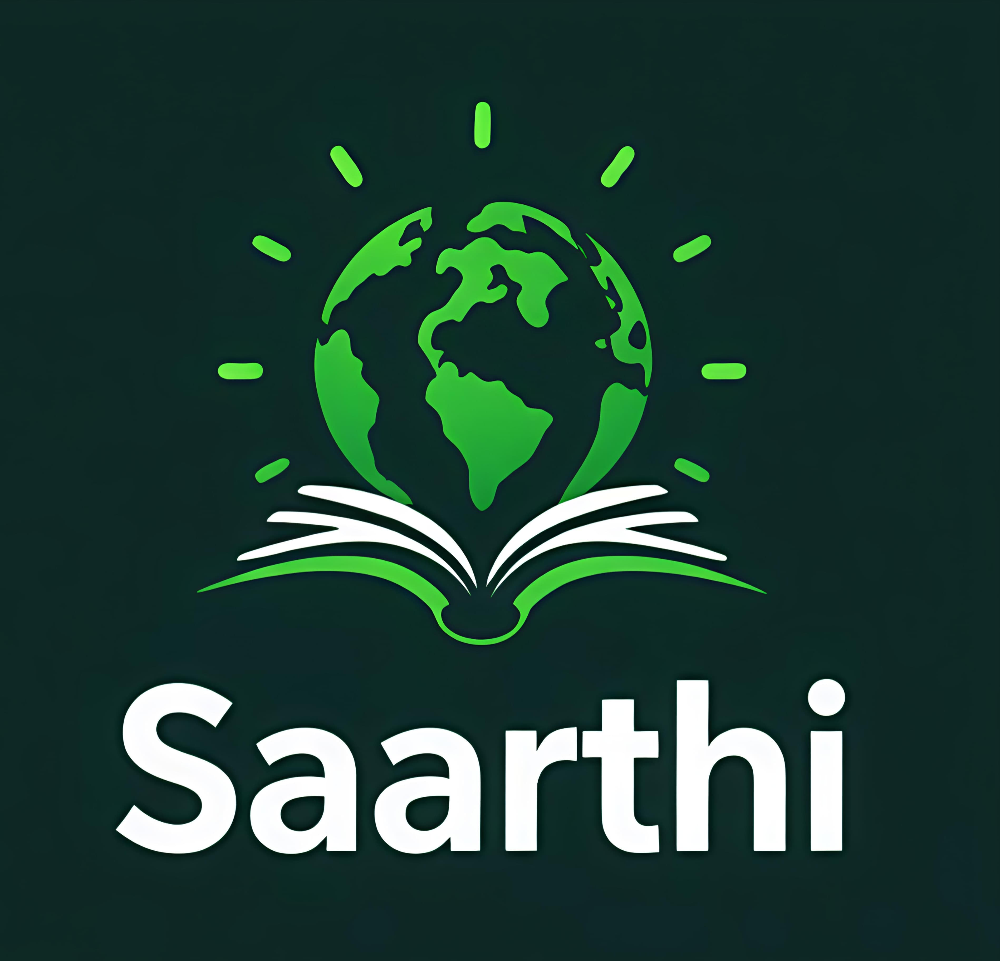

# SAARTHI  

**Your Companion in Learning, Anytime, Anywhere**  

  

  

SAARTHI is a transformative, **mobile-first education platform** designed to bridge gaps in quality education access for underserved communities. By combining offline capabilities, multilingual support, and community-driven sponsorships, SAARTHI empowers learners to thrive, regardless of internet access, economic status, or language barriers.  

## The Challenge  
Millions face systemic barriers to education:  
- **Infrastructure Deficits**: Limited internet access and digital devices in rural areas.  
- **Economic Constraints**: High costs of technology and educational resources.  
- **Language & Cultural Gaps**: Most platforms lack local language support and culturally relevant content.  
- **Digital Illiteracy**: Struggles with navigating online tools hinder learning progress.  

## Our Solution  
SAARTHI redefines inclusive education through:  
- **Offline-First Learning**: Preloaded courses accessible without internet.  
- **Multilingual Support**: Content tailored to local languages and cultural contexts.  
- **Gamified Engagement**: Interactive lessons and quizzes to boost retention.  
- **AI-Powered Assistance**: Personalized learning paths and real-time doubt resolution.  
- **Community Sponsorships**: Enable users to sponsor a child’s education or donate devices.  

## Features  
- 📱 **Offline Access**: Learn anytime, anywhere with preloaded courses and resources.  
- 🌍 **Localized Content**: Courses in regional languages with culturally relevant examples.  
- 🎮 **Gamified Learning**: Earn badges, unlock levels, and compete in challenges.  
- 🤖 **AI Tutor**: 24/7 assistance for homework help and concept explanations.  
- ❤️ **Sponsorship Hub**: Sponsor a child’s education or donate devices to communities.  
- 🤝 **NGO Partnerships**: Collaborate with NGOs to distribute devices and track impact.  

## Mission  
Our mission is to **democratize quality education** by breaking down economic, linguistic, and technological barriers. We aim to create a world where every learner, regardless of circumstance, can unlock their full potential.  

## How It Works  
1. **Download & Access**: Install the app and explore preloaded offline content.  
2. **Choose Your Language**: Select courses in your preferred regional language.  
3. **Learn & Engage**: Complete gamified modules or ask the AI tutor for help.  
4. **Support Communities**: Sponsor a learner’s education or donate devices via the app.  
5. **Track Progress**: Monitor individual achievements and community impact metrics.  

## Impact  
- **Universal Access**: Brings education to offline and low-income regions.  
- **Cultural Relevance**: Preserves local languages and traditions through tailored content.  
- **Community Upliftment**: Connects sponsors with learners to reduce financial barriers.  
- **Digital Literacy**: Empowers users to navigate technology confidently.  
- **Scalable Change**: Partners with NGOs to amplify reach and sustainability.  

**Join us in making education a universal right—not a privilege.**  

Made with ❤️ for a future where every mind can shine.  
